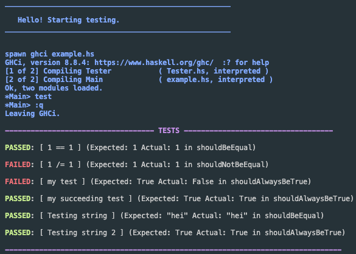

## Tests for Haskell 

### testScript.sh 
Run this to run the tests. Runs [startGHCI.sh](startGHCI.sh) as an expect script and interacts with ghci to run the tests. The file doing testing must be given in startGHCI.sh, and the function doing the testing must be named "test". 

The result must be either "True" or "False" and written to "out.txt" as shown in [example.hs](example.hs).

This is a side-project so I may be adding more features in the future. 

Feel free to use and copy this software, at your own risk.
